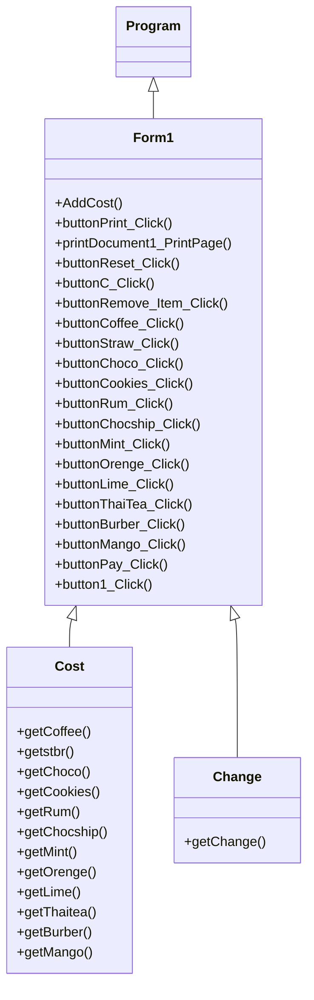

# Final_Project
### ความเป็นมาของโปรแกรม
### วัตถุประสงค์ของโปรแกรม
### โครงสร้างของโปรแกรม (Class diagram) 

```mermaid
classDiagram
    Program <|-- Form1
    Form1 <|-- Cost
    Form1 <|-- Change
    class Form1 {
        +AddCost()
        +buttonPrint_Click()
        +printDocument1_PrintPage()
        +buttonReset_Click()
        +buttonC_Click()
        +buttonRemove_Item_Click()
        +buttonCoffee_Click()
        +buttonStraw_Click()
        +buttonChoco_Click()
        +buttonCookies_Click()
        +buttonRum_Click()
        +buttonChocship_Click()
        +buttonMint_Click()
        +buttonOrenge_Click()
        +buttonLime_Click()
        +buttonThaiTea_Click()
        +buttonBurber_Click()
        +buttonMango_Click()
        +buttonPay_Click()
        +button1_Click()


    }
    class Cost{
        +getCoffee()
        +getstbr()
        +getChoco()
        +getCookies()
        +getRum()
        +getChocship()
        +getMint()
        +getOrenge()
        +getLime()
        +getThaitea()
        +getBurber()
        +getMango()
    }
    class Change{
        +getChange()
    }
```

### ชื่อของผู้พัฒนาโปรแกรม
